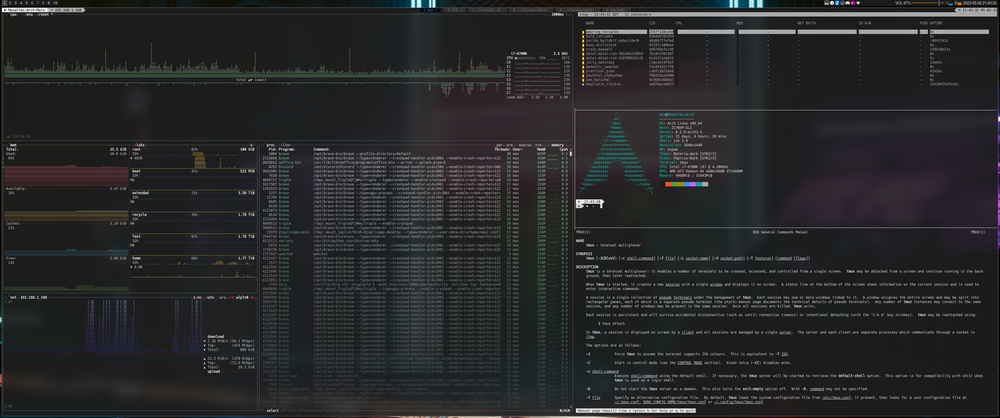
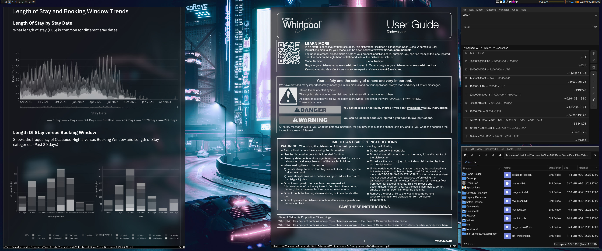
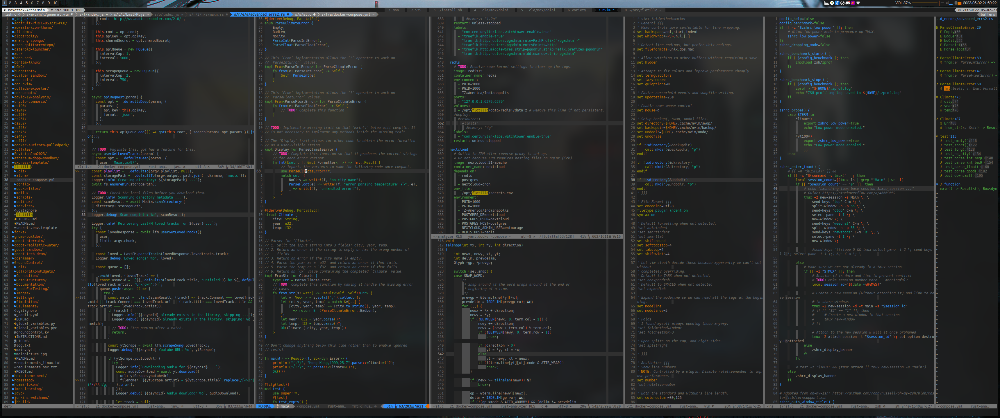
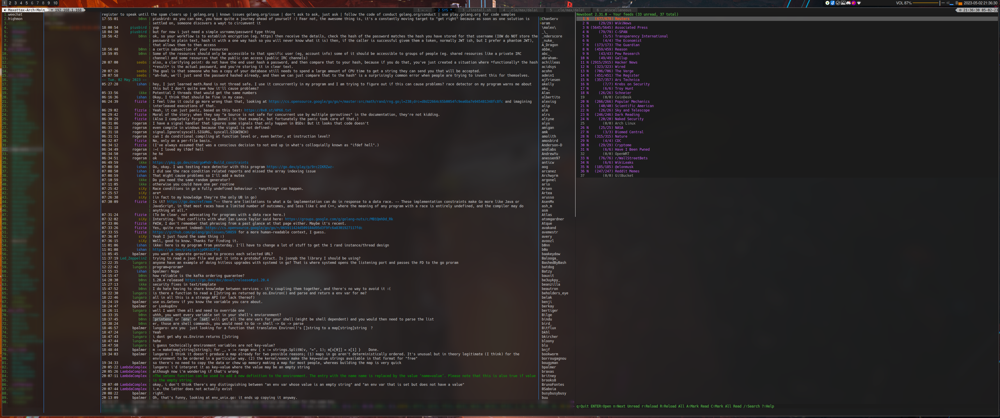
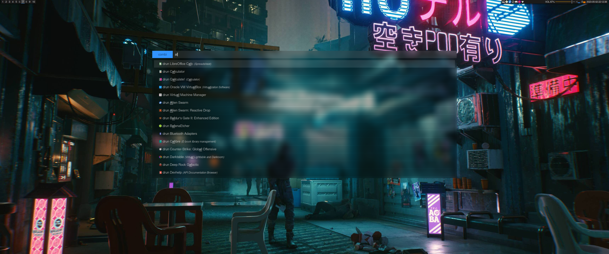
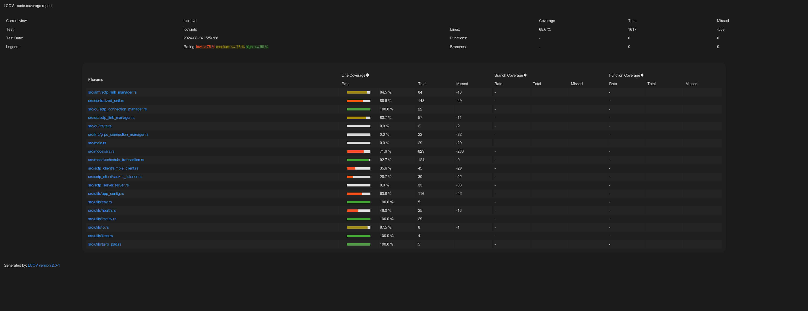

# `dotfiles`

[](https://github.com/Maxattax97/miscellaneous/actions/workflows/ci.yaml)

## Screenshots












## Installation

```bash
./install.sh
```

### `zsh`

Open a fresh shell and let the zsh plugins automatically install. You may have to restart your shell, sometimes it breaks.

```bash
zsh
```

### `tmux`

In tmux, you must install your plugins with the key combination `Ctrl-a I`.

### `nvim`

Open neovim to have it automatically install plugins. It will also automatically update every week.

```bash
nvim
```

## Updating

All of my configurations are linked to your home. Performing a `git pull` within
this repository then automatically gives you the latest version of these
files. Execute `./install.sh` after a pull to get any new packages or other updates.

## Overview

This repository contains configurations for:

- `bash`
- `bspwm`
- `btop`
- `chrony`
- `copyq`
- `dunst`
- `lcov`
- `mpd`
- `ncmpcpp`
- `neovim`
- `newsboat`
- `pacman`
- `pcmanfm`
- `picom`
- `polybar`
- `radare`
- `rofi`
- `sxhkd`
- `tmux`
- `variety`
- `weechat`
- `x11`
- `zathura`
- `zsh`

## `lcov`



## Credits

Environment inspired by [Bresilla](https://github.com/bresilla/dotfiles/).

Check out my site at [maxocull.com](https://www.maxocull.com/)!
